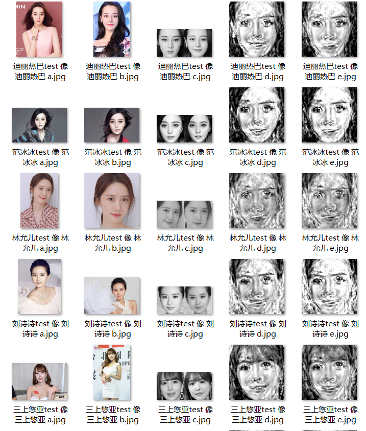
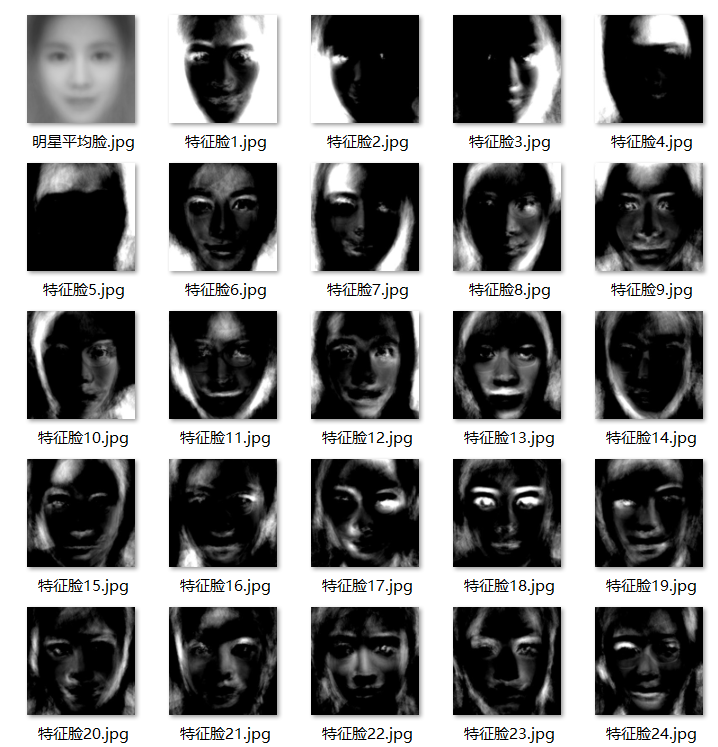

### PCA Face Recognition ###
Conduct PCA algorithm to achieve dimension reduction and face similarity comparison


### Introduction ###
This project contains resources files in these two directories: 
```star_images```  and  ```test_images```
You can put your own train images and test images here to make comparison. 
### Prerequisites ###
1. Python3
2. Python-opencv
### Gettring Started  ###
Once this project is installed on your machine, go the ```proj.py``` and type the line below on the terminal to lunch the project
       python proj.py 
The gray face images for ```star_images``` and ```test_images``` will be automatically created at ```star_faces``` and ```test_faces```
The "mean faces" images and "eigen faces" images will be automatically created at ```eigen_faces```
### Author ###
Ivan Chen
